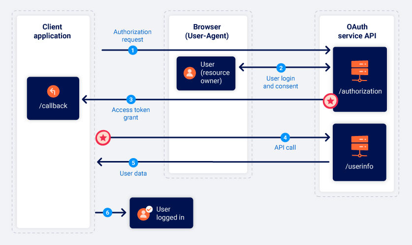

# OAuth grant types

The OAuth grant type determines the exact sequence of steps that are involved in the OAuth process. The grant type also affects how the client application communicates with the OAuth service at each stage, including how the access token itself is sent. For this reason, grant types are often referred to as "OAuth flows".

## OAuth scopes

For any OAuth grant type, the client application has to specify which data it wants to access and what kind of operations it wants to perform. It does this using the scope parameter of the authorization request it sends to the OAuth service.

```
scope=contacts
scope=contacts.read
scope=contact-list-r
scope=https://oauth-authorization-server.com/auth/scopes/user/contacts.readonly
```

## Authorization code grant type

In short, the client application and OAuth service first use redirects to exchange a series of browser-based HTTP requests that initiate the flow. The user is asked whether they consent to the requested access. If they accept, the client application is granted an "authorization code". The client application then exchanges this code with the OAuth service to receive an "access token", which they can use to make API calls to fetch the relevant user data.

All communication that takes place from the code/token exchange onward is sent server-to-server over a secure, preconfigured back-channel and is, therefore, invisible to the end user. This secure channel is established when the client application first registers with the OAuth service. At this time, a client_secret is also generated, which the client application must use to authenticate itself when sending these server-to-server requests.


### 1. Authorization request

The client application sends a request to the OAuth service's /authorization endpoint asking for permission to access specific user data. 

### 2. User login and consent

When the authorization server receives the initial request, it will redirect the user to a login page, where they will be prompted to log in to their account with the OAuth provider. For example, this is often their social media account.

They will then be presented with a list of data that the client application wants to access. This is based on the scopes defined in the authorization request. The user can choose whether or not to consent to this access.

### 3. Authorization code grant

If the user consents to the requested access, their browser will be redirected to the /callback endpoint that was specified in the redirect_uri parameter of the authorization request. The resulting GET request will contain the authorization code as a query parameter. Depending on the configuration, it may also send the state parameter with the same value as in the authorization request.

### 4. Access token request

Once the client application receives the authorization code, it needs to exchange it for an access token. To do this, it sends a server-to-server POST request to the OAuth service's /token endpoint. All communication from this point on takes place in a secure back-channel and, therefore, cannot usually be observed or controlled by an attacker.

```
POST /token HTTP/1.1
Host: oauth-authorization-server.com
…
client_id=12345&client_secret=SECRET&redirect_uri=https://client-app.com/callback&grant_type=authorization_code&code=a1b2c3d4e5f6g7h8
```
*client_secret*
The client application must authenticate itself by including the secret key that it was assigned when registering with the OAuth service.

*grant_type*
Used to make sure the new endpoint knows which grant type the client application wants to use. In this case, this should be set to *authorization_code.*

### 5. Access token grant

The OAuth service will validate the access token request. If everything is as expected, the server responds by granting the client application an access token with the requested scope.

### 6. API call

Now the client application has the access code, it can finally fetch the user's data from the resource server. To do this, it makes an API call to the OAuth service's */userinfo* endpoint. The access token is submitted in the *Authorization: Bearer* header to prove that the client application has permission to access this data.

```
GET /userinfo HTTP/1.1
Host: oauth-resource-server.com
Authorization: Bearer z0y9x8w7v6u5
```

### 7. Resource grant

The resource server should verify that the token is valid and that it belongs to the current client application. If so, it will respond by sending the requested resource i.e. the user's data based on the scope of the access token.

```json
{
    "username":"carlos",
    "email":"carlos@carlos-montoya.net",
    …
}
```

The client application can finally use this data for its intended purpose. In the case of OAuth authentication, it will typically be used as an ID to grant the user an authenticated session, effectively logging them in.

## Implicit grant type

The implicit grant type is much simpler. Rather than first obtaining an authorization code and then exchanging it for an access token, the client application receives the access token immediately after the user gives their consent.



### 1. Authorization request

The implicit flow starts in much the same way as the authorization code flow. The only major difference is that the response_type parameter must be set to token.

### 2. User login and consent

The user logs in and decides whether to consent to the requested permissions or not. This process is exactly the same as for the authorization code flow.

### 3. Access token grant

If the user gives their consent to the requested access, this is where things start to differ. The OAuth service will redirect the user's browser to the redirect_uri specified in the authorization request. However, instead of sending a query parameter containing an authorization code, it will send the access token and other token-specific data as a URL fragment.

```
GET /callback#access_token=z0y9x8w7v6u5&token_type=Bearer&expires_in=5000&scope=openid%20profile&state=ae13d489bd00e3c24 HTTP/1.1
Host: client-app.com
```

As the access token is sent in a URL fragment, it is never sent directly to the client application. Instead, the client application must use a suitable script to extract the fragment and store it.

### 4. API call

Once the client application has successfully extracted the access token from the URL fragment, it can use it to make API calls to the OAuth service's /userinfo endpoint. Unlike in the authorization code flow, this also happens via the browser.

```
GET /userinfo HTTP/1.1
Host: oauth-resource-server.com
Authorization: Bearer z0y9x8w7v6u5
```

### 5. Resource grant

The resource server should verify that the token is valid and that it belongs to the current client application. If so, it will respond by sending the requested resource i.e. the user's data based on the scope associated with the access token.

``` json
{
    "username":"carlos",
    "email":"carlos@carlos-montoya.net"
}
```

The client application can finally use this data for its intended purpose. In the case of OAuth authentication, it will typically be used as an ID to grant the user an authenticated session, effectively logging them in.